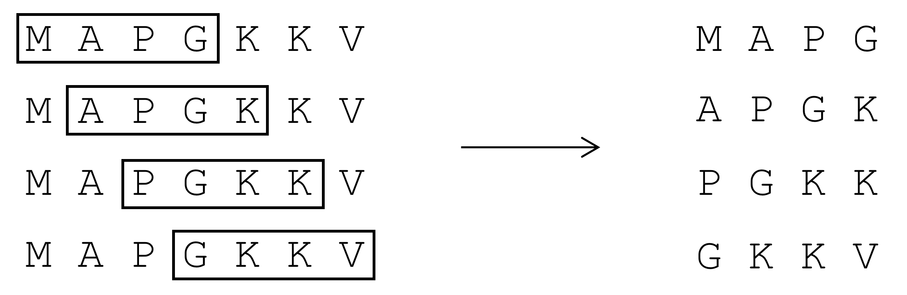
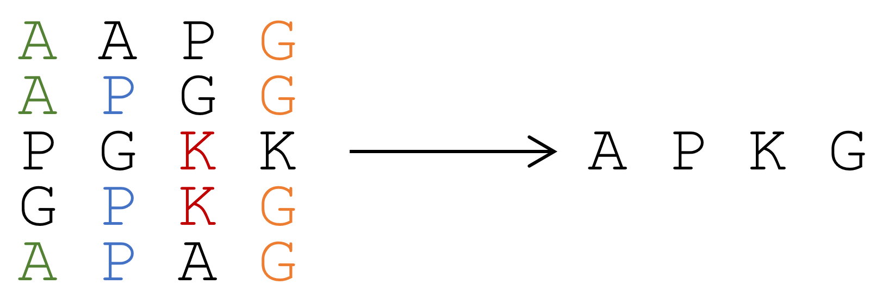

# sequenceKmeans
This is a tool for performing K-means clustering on a set of protein strings. The scripts contained here can be used to transform a set of protein sequences into a set of feature vectors by using K-means feature learning. Multithreading is supported, simply change the value of ncpus.

stringKmeans.py is a stand-alone module whose syntax is based upon the scikit-learn kmeans function. 

I have provided some sample data to demonstrate how it works. To run with default parameters on the sample data, type these commands:

python3 vectorScriptExample.py  
python3 runCast.py

# How it works
First the sequences are broken into fragments

  

Then the fragments are clustered according to the K-means algorithm. The centroid of each cluster is computed by taking the mode at each character position

  

A final feature vector is created for each of the original sequences based on which centroids each of its fragments were nearest to

  

# References
The cast matrix and data files were obtained from http://pongor.itk.ppke.hu/benchmark/#/Browse

The original source of the protein data:

Pollack, J.D., Li, Q. and Pearl, D.K. (2005) Taxonomic utility of a phylogenetic analysis of phosphoglycerate kinase proteins of Archaea, Bacteria, and Eukaryota: insights by Bayesian analyses, Mol Phylogenet Evol, 35, 420-430. 

The paper presented at BIOCOB 2018 on this method can be found here: https://www.google.com/url?sa=t&rct=j&q=&esrc=s&source=web&cd=1&cad=rja&uact=8&ved=0ahUKEwja1uy6x_baAhWErVkKHdf0BAgQFgguMAA&url=https%3A%2F%2Fweb.njit.edu%2F~usman%2FBIOCOB_2018_kmeans.pdf&usg=AOvVaw1UvE3vc2g52kdEvkND2pD0
